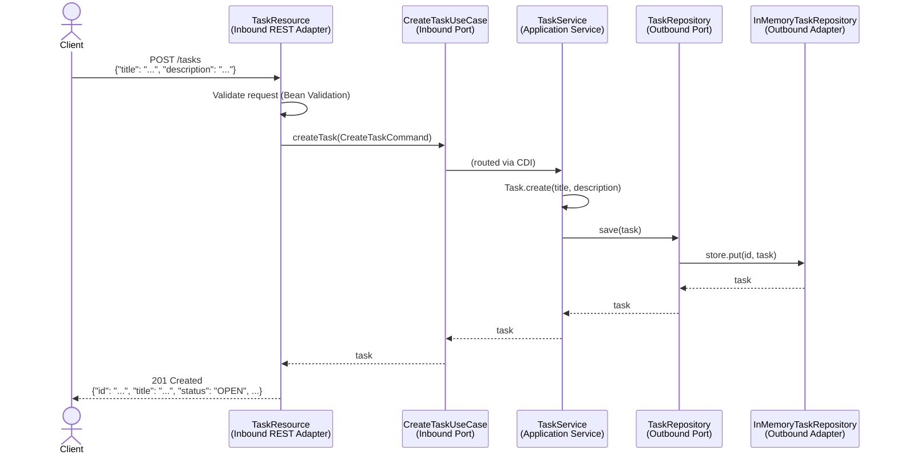
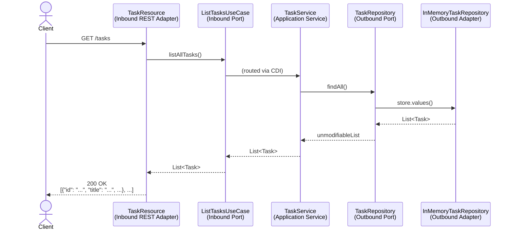
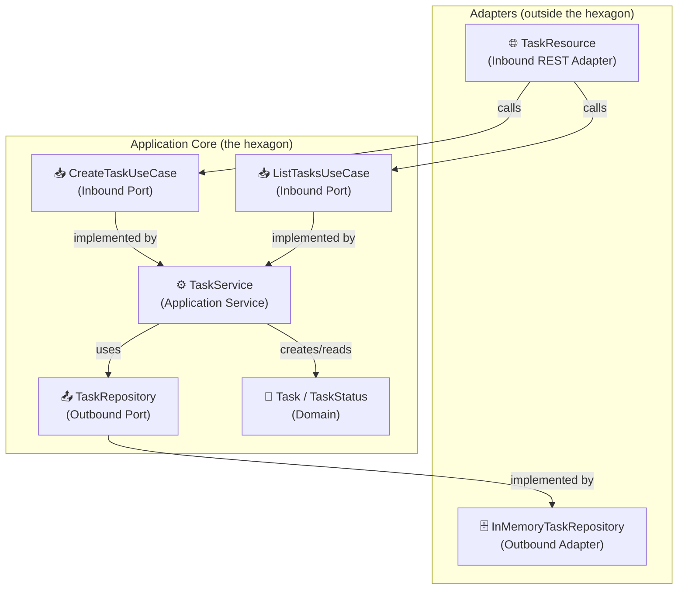

# Use-Case Diagrams

Mermaid diagrams describing the two use cases implemented in this example.
Render them in any Markdown viewer that supports [Mermaid](https://mermaid.js.org/)
(GitHub renders Mermaid natively in Markdown files).

---

## Use Case 1 – Create a Task

---

## Use Case 2 – List All Tasks

---

## Architecture Overview – Hexagon

> **Key insight:** arrows always point *inward* into the hexagon for inbound
> ports and *outward* from the hexagon for outbound ports. The application core
> never references adapters.
